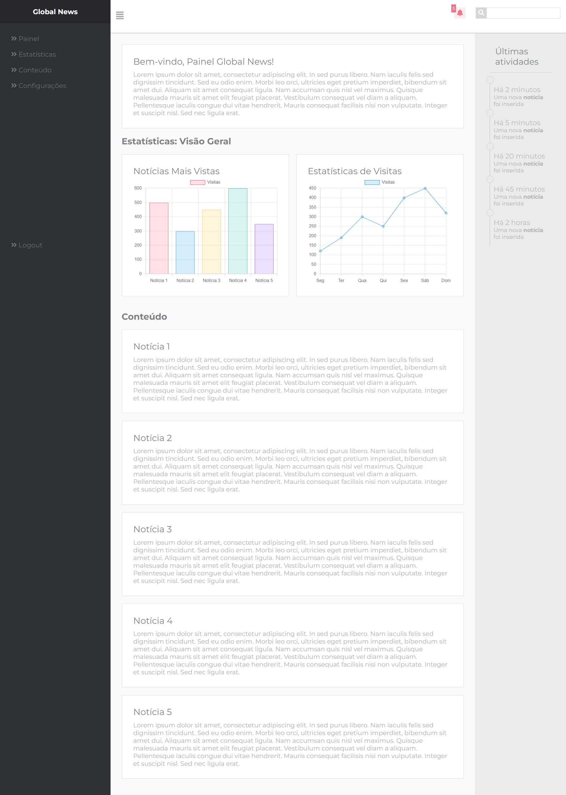

<h1>Global News Dashboard</h1>
 

Descrição: Este projeto é um dashboard front-end para o site de notícias fictício "Global News". O painel oferece uma interface de fácil navegação, projetada para gerenciar conteúdos e visualizar estatísticas do site.

<h4>Funcionalidades Principais:</h4>

<li>Menu de navegação lateral: Responsivo para dispositivos mobile, permite acessar diferentes seções como Painel, Estatísticas, Conteúdo, Configurações, e Logout. O design garante que o menu se adapte a diferentes tamanhos de tela, proporcionando uma experiência fluida tanto em desktop quanto em dispositivos móveis.</li>
  
<li>Pesquisa rápida: Barra de pesquisa no cabeçalho para facilitar a busca por conteúdos.</li>

<li>Indicadores de notificações: Mostra o número de alertas e notificações.</li>

<li>Seção de estatísticas e conteúdo: Permite visualizar informações importantes relacionadas ao desempenho do site e ao conteúdo publicado.</li>

